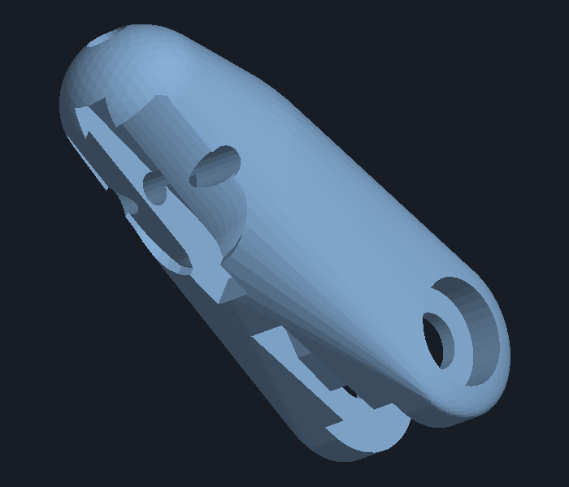
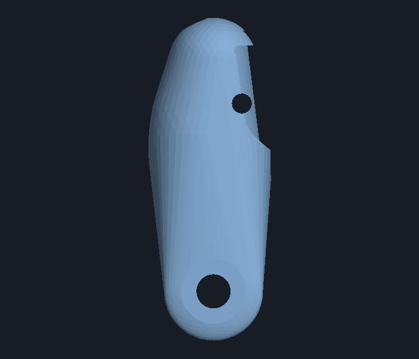
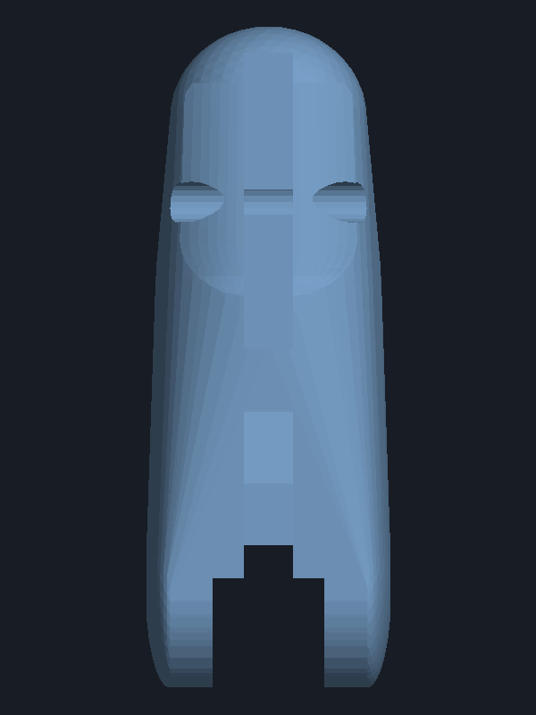
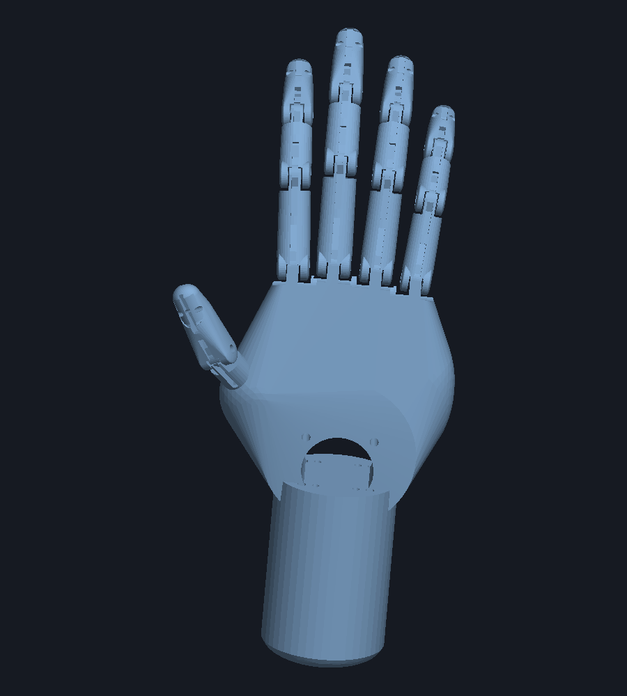

# Anthropomorphic Robotic Hand CAD — Iteration 7 (v7.0) Specification & Verification Report

## Overview & Key Additions
Iteration 7 (**v7.0**) introduces:
1. **Anatomical Fingernail Bed Carving**: Shallow (0.70 mm deep) nail plate recess on all distal fingertip segments (Index, Middle, Ring, Pinky, and Thumb).
2. **Restored Concealed M3 Screw Head Counterbore & Nut Pocket on Distal Phalanges**: Left fork wall features a concealed Ø6.5 mm counterbore (up to 2.6 mm depth) for M3 button/socket screw heads; right fork wall features a matching counterbore for M3 hex nuts.
3. **One-Directional Articulation (Mechanical Extension Hard Stops)**: Rigid 0° stops block backward hyperextension across all joints while preserving smooth, unobstructed 0° to 95° palmar fist flexion.
4. **Continuous All-The-Way Dorsal Groove & Concealed Retaining Bridges**: Open-from-above 2.4 mm wide groove with flush 1.3 mm thick non-protruding bridges for the passive return elastic band.

---

## 1. Visual Verification & Renders

### Distal Fingertip with Restored M3 Screw Head Counterbore & Nail Bed

*Isometric perspective displaying both the female clevis fork with the concealed M3 screw head counterbore on the left fork and the shallow nail bed carving on the dorsal tip.*

### Lateral Fork View: Concealed M3 Screw Head Counterbore

*Side view of the distal phalanx female clevis fork showing the precision Ø6.5 mm counterbore and concentric Ø3.4 mm hinge pin pass-through.*

### Distal Fingertip Dorsal View (Nail Bed & Continuous Groove)

*Dorsal top-down view showing the 0.70 mm deep shallow fingernail recess, proximal rounded cuticle arc (eponychium), lateral margins, and continuous dorsal groove extending through the concealed flush bridge.*

### Complete Hand Assembly (v7.0)

*Complete 17-part articulated assembly with fingernail recesses across all 5 distal tips, continuous dorsal grooves, restored hardware pockets, and opposable thumb.*

---

## 2. Anatomical Fingernail Bed Architecture

| Parameter | Value | Design Intent & Functional Role |
| :--- | :--- | :--- |
| **Recess Depth** | `0.70 mm` | Provides a shallow seat for bonding press-on, acrylic, or 3D-printed nail plates flush with surrounding finger tissue without thinning structural core. |
| **Nail Width Ratio** | `72%` ($0.72 \times W$) | Anatomical proportions leaving $\sim 1.7 \text{ to } 2.0\text{ mm}$ lateral borders (*perionychium / lateral nail folds*). |
| **Proximal Cuticle Origin** | `58%` ($0.58 \times L$) | Natural anatomical cuticle positioning with a rounded $C^1$-continuous arch (*eponychium*). |
| **Distal Apex Extension** | $100\%$ ($L$) | Extends seamlessly to fingertip apex, creating an open nail free edge for realistic nail attachment. |
| **Knot Concealment** | Protected | Covers the $\varnothing 2.0\text{ mm}$ distal transverse rubber band retention bore ($y = 0.78 L$). Attaching the nail plate fully protects and conceals the elastic band knot. |

---

## 3. Restored Hardware Mounts on Distal Phalanges

| Feature | Dimension | Specification & Function |
| :--- | :--- | :--- |
| **Left Fork Counterbore** | $\varnothing 6.5\text{ mm}$, Depth: $\min(2.6, \text{fork\_wall} - 0.7)\text{ mm}$ | Fully recesses M3 socket or button head screws flush inside the outer fork wall. |
| **Right Fork Nut Pocket** | $\varnothing 6.5\text{ mm}$, Depth: $\min(2.4, \text{fork\_wall} - 0.7)\text{ mm}$ | Captures and recesses standard M3 hex or round nuts. |
| **Hinge Pin Bore** | $\varnothing 3.4\text{ mm}$ through-bore | Smooth clearance fit for M3 shoulder bolts and hinge pins. |

---

## 4. Solid Manifold & Kinematic Verification

All **17 STL parts** generated in `stl_exports_v7/` are **100% watertight solid manifolds**:

| Part Name | File Name (`stl_exports_v7/`) | File Size | Volume ($\text{mm}^3$) | Watertight Solid? |
| :--- | :--- | :---: | :---: | :---: |
| **Index Distal** | `index_distal_v7.stl` | 207.1 KB | 2,093.5 | **True** |
| **Index Intermediate** | `index_intermediate_v7.stl` | 252.8 KB | 1,877.0 | **True** |
| **Index Proximal** | `index_proximal_v7.stl` | 259.3 KB | 2,829.4 | **True** |
| **Middle Distal** | `middle_distal_v7.stl` | 207.6 KB | 2,382.2 | **True** |
| **Middle Intermediate** | `middle_intermediate_v7.stl` | 253.2 KB | 2,218.7 | **True** |
| **Middle Proximal** | `middle_proximal_v7.stl` | 263.2 KB | 3,439.8 | **True** |
| **Ring Distal** | `ring_distal_v7.stl` | 207.8 KB | 2,048.2 | **True** |
| **Ring Intermediate** | `ring_intermediate_v7.stl` | 252.0 KB | 1,959.3 | **True** |
| **Ring Proximal** | `ring_proximal_v7.stl` | 258.7 KB | 2,977.2 | **True** |
| **Pinky Distal** | `pinky_distal_v7.stl` | 206.0 KB | 1,542.1 | **True** |
| **Pinky Intermediate** | `pinky_intermediate_v7.stl` | 248.2 KB | 1,454.2 | **True** |
| **Pinky Proximal** | `pinky_proximal_v7.stl` | 257.9 KB | 2,273.2 | **True** |
| **Thumb Distal** | `thumb_distal_v7.stl` | 215.5 KB | 3,036.1 | **True** |
| **Thumb Proximal** | `thumb_proximal_v7.stl` | 262.3 KB | 3,591.0 | **True** |
| **Palm** | `palm_v7.stl` | 243.4 KB | 116,849.2 | **True** |
| **Forearm Servo Adapter** | `forearm_servo_adapter_v7.stl` | 87.2 KB | 40,135.7 | **True** |
| **Full Hand Assembly** | `robotic_hand_full_assembly_v7.stl` | 3,681.0 KB | 190,706.9 | **True** |

### Kinematic Results
- **Flexion ($0^\circ \to 95^\circ$):** Zero collision throughout the complete fist-closing range ($0.000\text{ mm}^3$ at PIP & DIP joints).
- **Hyperextension ($< 0^\circ$):** Rigidly stopped by planar mechanical hard-stop shoulders at the dorsal joint interface.
