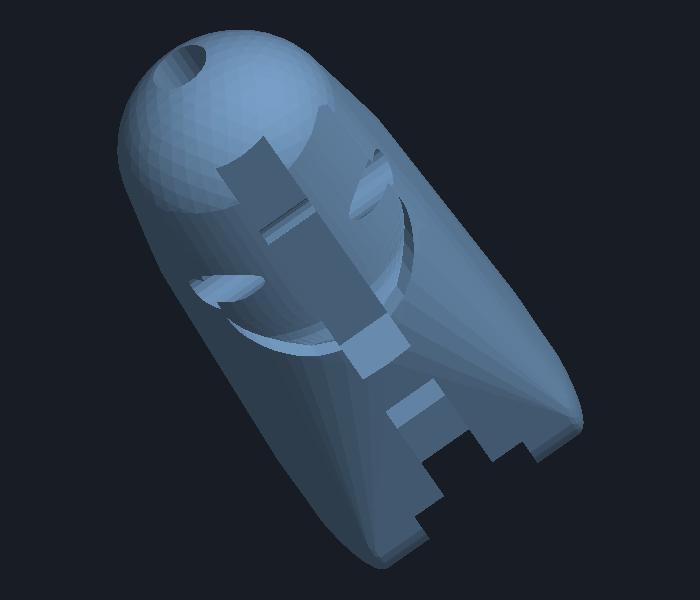

# Anthropomorphic Robotic Hand CAD — Iteration 7 (v7.0) Specification & Verification Report

## Overview & Key Additions
Iteration 7 (**v7.0**) introduces an **anatomical fingernail bed carving** (shallow nail plate recess) across all distal fingertip segments (Index, Middle, Ring, Pinky, and Thumb), while retaining all functional kinematic features from v6 (continuous dorsal rubber band grooves, concealed flush retaining bridges, rigid one-directional $0^\circ \to 95^\circ$ flexion hard stops, and Ø2.5 mm tendon wire bores).

---

## 1. Visual Verification & Renders

### Distal Fingertip with Anatomical Fingernail Bed

*Dorsal top-down view showing the 0.70 mm deep shallow fingernail recess, proximal rounded cuticle arc (eponychium), lateral margins, and continuous dorsal groove extending through the concealed flush bridge.*

### Isometric Detail of Distal Fingertip & Nail Seat

*Isometric perspective displaying the nail bed recess, distal transverse retention hole, and the flush, non-protruding concealed bridge.*

### Complete Hand Assembly (v7.0)

*Complete 17-part articulated assembly with fingernail recesses across all 5 distal tips, continuous dorsal grooves, and opposable thumb.*

---

## 2. Anatomical Fingernail Bed Architecture

| Parameter | Value | Design Intent & Functional Role |
| :--- | :--- | :--- |
| **Recess Depth** | `0.70 mm` | Provides a shallow seat for bonding press-on, acrylic, or 3D-printed nail plates flush with surrounding finger tissue without thinning structural core. |
| **Nail Width Ratio** | `72%` ($0.72 \times W$) | Anatomical proportions leaving $\sim 1.7 \text{ to } 2.0\text{ mm}$ lateral borders (*perionychium / lateral nail folds*). |
| **Proximal Cuticle Origin** | `58%` ($0.58 \times L$) | Natural anatomical cuticle positioning with a rounded $C^1$-continuous arch (*eponychium*). |
| **Distal Apex Extension** | $100\%$ ($L$) | Extends seamlessly to fingertip apex, creating an open nail free edge for realistic nail attachment. |
| **Knot Concealment** | Protected | Covers the $\varnothing 2.0\text{ mm}$ distal transverse rubber band retention bore ($y = 0.78 L$). Attaching the nail plate fully protects and conceals the elastic band knot. |

---

## 3. Solid Manifold & Kinematic Verification

All **17 STL parts** generated in `stl_exports_v7/` are **100% watertight solid manifolds**:

| Part Name | File Name (`stl_exports_v7/`) | File Size | Volume ($\text{mm}^3$) | Watertight Solid? |
| :--- | :--- | :---: | :---: | :---: |
| **Index Distal** | `index_distal_v7.stl` | 196.0 KB | 2,205.7 | **True** |
| **Index Intermediate** | `index_intermediate_v7.stl` | 252.8 KB | 1,877.0 | **True** |
| **Index Proximal** | `index_proximal_v7.stl` | 259.3 KB | 2,829.4 | **True** |
| **Middle Distal** | `middle_distal_v7.stl` | 196.5 KB | 2,494.3 | **True** |
| **Middle Intermediate** | `middle_intermediate_v7.stl` | 253.2 KB | 2,218.7 | **True** |
| **Middle Proximal** | `middle_proximal_v7.stl` | 263.2 KB | 3,439.8 | **True** |
| **Ring Distal** | `ring_distal_v7.stl` | 196.7 KB | 2,160.3 | **True** |
| **Ring Intermediate** | `ring_intermediate_v7.stl` | 252.0 KB | 1,959.3 | **True** |
| **Ring Proximal** | `ring_proximal_v7.stl` | 258.7 KB | 2,977.2 | **True** |
| **Pinky Distal** | `pinky_distal_v7.stl` | 195.3 KB | 1,635.0 | **True** |
| **Pinky Intermediate** | `pinky_intermediate_v7.stl` | 248.2 KB | 1,444.6 | **True** |
| **Pinky Proximal** | `pinky_proximal_v7.stl` | 257.9 KB | 2,270.8 | **True** |
| **Thumb Distal** | `thumb_distal_v7.stl` | 202.2 KB | 3,149.2 | **True** |
| **Thumb Proximal** | `thumb_proximal_v7.stl` | 262.3 KB | 3,591.0 | **True** |
| **Palm** | `palm_v7.stl` | 243.4 KB | 116,849.2 | **True** |
| **Forearm Servo Adapter** | `forearm_servo_adapter_v7.stl` | 87.2 KB | 40,135.7 | **True** |
| **Full Hand Assembly** | `robotic_hand_full_assembly_v7.stl` | 3,623.6 KB | 191,237.4 | **True** |

### Kinematic Results
- **Flexion ($0^\circ \to 95^\circ$):** Zero collision throughout the complete fist-closing range ($0.000\text{ mm}^3$ at PIP & DIP joints).
- **Hyperextension ($< 0^\circ$):** Rigidly stopped by planar mechanical hard-stop shoulders at the dorsal joint interface.

---

## 4. Antagonist Actuation & Continuous Dorsal Groove

- **Anterior / Palmar:** Continuous $\varnothing 2.5\text{ mm}$ bore for active servo pull cable.
- **Posterior / Dorsal:** Open-from-above $2.4\text{ mm}$ continuous groove for passive return elastic band.
- **Concealed Retaining Bridges:** $1.3\text{ mm}$ roof thickness, flush with natural skin contour, keeping the elastic band secured without snagging or exterior protrusion.
